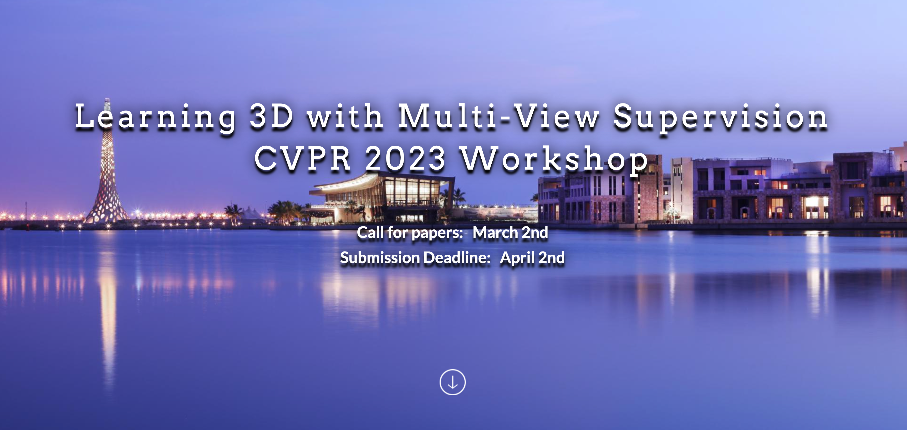

# 3DMV 
3DMV is a workshop on Learning 3D with Multi-View Supervision hosted in CVPR 2023, Vancouver, Canada. 

# Acknowledgement
[1] This website is built upon [fgva](https://github.com/fgva-cvpr21/fgva-cvpr21.github.io). 

[2] The random graph generation animation is based on the code example from [Erkal Selman](http://bl.ocks.org/erkal/9746513). 
